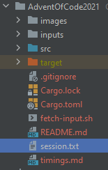
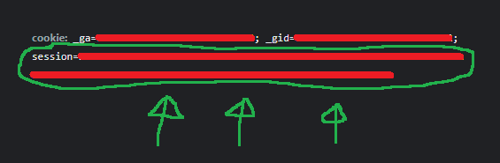
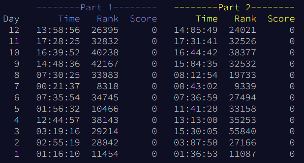

# AdventOfCode2021
Solutions to AoC 2021 problems in Rust.

See [timings.md](./timings.md) for execution time and output of each solution.

## Requirements
Create ``session.txt`` file in the project root (file ignored by git) with this line:

```sh
export AOC_SESSION={number} # cookie session value in your browser
```





## Get problem inputs
```sh
bash fetch-input.sh {day} # current day with 2 digits, e.g 01
```

## Run problems using bash scripts
```sh
bash scripts/run-problem.sh {day}  # run a specific day, e.g 01
bash scripts/run-all.sh            # run all days
```

## Run problems using cargo commands
```sh
cargo run --release --bin {day} # run a specific day, e.g 01
cargo run --release             # run all days
```

## Leaderboard placings

